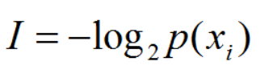
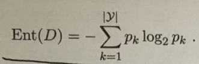
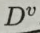
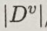
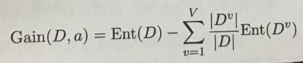

# 决策树
## 熵（Entropy）
表示粒子移动的自由度，熵越大，自由度越高


## 信息熵
信息熵（information_entropy）是度量样本集合纯度最常用的指标

**信息熵值越小，样本纯度越高**

## 信息增益（information gain）
分类前的信息熵减去分类后的信息熵
假定离散属性a有V个可能的取值，若使用a来对样本集D进行划分，则会产生V个分支节点，其中第v个分支节点包含了D中所有在属性a上取值为av的样本，记为，为中样本数，信息增益公式如下：

**信息增益越大，使用属性a来进行划分所获得的纯度提升越大**

## 交叉熵
交叉熵作为损失函数可以衡量两个分布的相似性
https://github.com/user-ZJ/Machine_learning_Fundamentals

## 条件熵
https://github.com/user-ZJ/Machine_learning_Fundamentals

## 分类及回归树（CART）
使用**基尼指数**来选择属性划分，选择基尼指数最小的属性作为最优划分属性。  
划分后数据集纯度可用基尼值来度量：
   
基尼值反映了从数据集D中随机抽取两个样本，其类别标记不一致的概率，因此，基尼值越小，数据集D的纯度越高。  
  


## ID3决策树
ID3算法(Iterative Dichotomiser 3，迭代二叉树3代)是一种贪心算法，用来构造决策树。ID3算法起源于概念学习系统（CLS），以信息熵的下降速度为选取测试属性的标准，即在每个节点选取还尚未被用来划分的具有最高信息增益的属性作为划分标准，然后继续这个过程，直到生成的决策树能完美分类训练样例

## 增益率
https://github.com/user-ZJ/Machine_learning_Fundamentals

## C4.5决策树
通过信息增益率选择分裂属性；先从候选划分属性中招数信息增益高于平均水平的属性，再从中选择增益率最高的。  

## 连续值处理
当属性类型为连续型，需要对数据进行离散化处理。通过二分法对连续属性进行处理。  
**核心思想**：  
1. 将属性A的N个属性值按照升序排列；  
2. 通过二分法将属性A的所有属性值分成两部分（共有N-1种划分方法，二分的阈值为相邻两个属性值的中间值）；  
3. 计算每种划分方法对应的信息增益，选取信息增益最大的划分方法的阈值作为属性A二分的阈值。  


## 缺失值处理
现实任务中会有不完整样本，即样本的某些属性值缺失。  
含有缺失属性的样本集会一般会导致三个问题：  
1. 在构建决策树时，每一个分裂属性的选取是由训练样本集中所有属性的信息増益率来决定的。而在此阶段，如果训练样本集中有些样本缺少一部分属性，此时该如何计算该属性的信息増益率；  
> 在计算各属性的信息増益率时，若某些样本的属性值未知，那么可以这样处理：  
> 计算某属性的信息増益率时忽略掉缺失了此属性的样本；  
> 或者通过此属性的样本中出现频率最高的属性值，賦值给缺失了此属性的样本。  
2. 当已经选择某属性作为分裂属性时，样本集应该根据该属性的值来进行分支，但对于那些该属性的值为未知的样本，应该将它分支到哪一棵子树上；  
> 假设属性Ａ已被选择作为决策树中的一个分支节点，在对样本集进行分支的时候，对于那些属性Ａ的值未知的样本，可以这样处理：  
> 不处理那些属性Ａ未知的样本，即简单的忽略它们；  
> 或者根据属性Ａ的其他样本的取值，来对未知样本进行赋值；  
> 或者为缺失属性Ａ的样本单独创建一个分支，不过这种方式得到的决策树模型结点数显然要増加，使模型更加复杂了。   
> 或者让同一个样本以不同的概率划入到不同的子节点中。  
3. 在决策树已经构建完成后，如果待分类样本中有些属性值缺失，则该样本的分类过程如何进行。  
> 根据己经生成的决策树模型，对一个待分类的样本进行分类时，若此样本的属性Ａ的值未知，可以这样处理：  
> 待分类样本在到达属性Ａ的分支结点时即可结束分类过程，此样本所属类别为属性Ａ的子树中概率最大的类别；  
> 或者把待分类样本的属性Ａ赋予一个最常见的值，然后继续分类过程。  

## 随机森林(Random Forest)
随机森林就是通过集成学习的思想将多棵树集成的一种算法，它的基本单元是决策树，而它的本质属于机器学习的一大分支——集成学习（Ensemble Learning）方法
从直观角度来解释，每棵决策树都是一个分类器（假设现在针对的是分类问题），那么对于一个输入样本，N棵树会有N个分类结果。而随机森林集成了所有的分类投票结果，将投票次数最多的类别指定为最终的输出，这就是一种最简单的 Bagging 思想

## 决策树中的超参数
1. 最大深度
2. 每片叶子最小样本数
3. 每次分裂的最小样本数
4. 最大特征数
有时，我们会遇到特征数量过于庞大，而无法建立决策树的情况。在这种状况下，对于每一个分裂，我们都需要检查整个数据集中的每一个特征。这种过程极为繁琐。而解决方案之一是限制每个分裂中查找的特征数。如果这个数字足够庞大，我们很有可能在查找的特征中找到良好特征（尽管也许并不是完美特征）。然而，如果这个数字小于特征数，这将极大加快我们的计算速度

## sklearn中使用决策树
```
# Import statements 
from sklearn.tree import DecisionTreeClassifier
from sklearn.metrics import accuracy_score
import pandas as pd
import numpy as np

# Read the data.
data = np.asarray(pd.read_csv('data.csv', header=None))
# Assign the features to the variable X, and the labels to the variable y. 
X = data[:,0:2]
y = data[:,2]

# TODO: Create the decision tree model and assign it to the variable model.
# You won't need to, but if you'd like, play with hyperparameters such
# as max_depth and min_samples_leaf and see what they do to the decision
# boundary.
model = DecisionTreeClassifier()

# TODO: Fit the model.
model.fit(X, y)

# TODO: Make predictions. Store them in the variable y_pred.
y_pred = model.predict(X)


# TODO: Calculate the accuracy and assign it to the variable acc.
acc = accuracy_score(y, y_pred)
```

## 决策树实际应用
查看Titanic Solutions-zh.ipynb