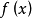
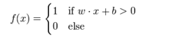
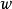
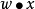
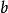
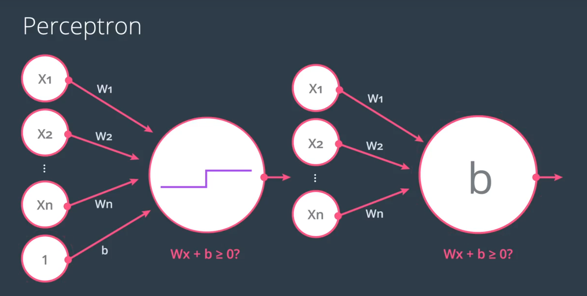

# 感知器
## 定义
>感知器，也可翻译为感知机，是Frank Rosenblatt在1957年就职于Cornell航空实验室(Cornell Aeronautical Laboratory)时所发明的一种人工神经网络。它可以被视为一种最简单形式的前馈式人工神经网络，是一种二元线性分类器。感知器主要的本质缺陷是它不能处理线性不可分问题。

> 常用的有感知机学习、最小二乘法和梯度下降法

## 数学描述
感知器使用特征向量来表示的前馈式人工神经网络，它是一种二元分类器，把矩阵上的输入（实数值向量）映射到输出值上（一个二元的值）。


是实数的表式权重的向量，是点积。是偏置，一个不依赖于任何输入值的常数。
两种表示法为：


## 感知器训练


## 代码实现
```
import numpy as np
# Setting the random seed, feel free to change it and see different solutions.
np.random.seed(42)

def stepFunction(t):
    if t >= 0:
        return 1
    return 0

def prediction(X, W, b):
    return stepFunction((np.matmul(X,W)+b)[0])

# TODO: Fill in the code below to implement the perceptron trick.
# The function should receive as inputs the data X, the labels y,
# the weights W (as an array), and the bias b,
# update the weights and bias W, b, according to the perceptron algorithm,
# and return W and b.
def perceptronStep(X, y, W, b, learn_rate = 0.01):
    # Fill in code
    for i in range(len(X)):
        y_hat = prediction(X[i],W,b)
        if y[i]-y_hat == 1:
            for j in range(len(W)):
                W[j] += X[i][j]*learn_rate
            #W[0] += X[i][0]*learn_rate
            #W[1] += X[i][1]*learn_rate
            b += learn_rate
        elif y[i]-y_hat == -1:
            for j in range(len(W)):
                W[j] -= X[i][j]*learn_rate
            #W[0] -= X[i][0]*learn_rate
            #W[1] -= X[i][1]*learn_rate
            b -= learn_rate
    return W, b
    
# This function runs the perceptron algorithm repeatedly on the dataset,
# and returns a few of the boundary lines obtained in the iterations,
# for plotting purposes.
# Feel free to play with the learning rate and the num_epochs,
# and see your results plotted below.
def trainPerceptronAlgorithm(X, y, learn_rate = 0.1, num_epochs = 1000):
    x_min, x_max = min(X.T[0]), max(X.T[0])
    y_min, y_max = min(X.T[1]), max(X.T[1])
    W = np.array(np.random.rand(2,1))
    b = np.random.rand(1)[0] + x_max
    # These are the solution lines that get plotted below.
    boundary_lines = []
    for i in range(num_epochs):
        # In each epoch, we apply the perceptron step.
        W, b = perceptronStep(X, y, W, b, learn_rate)
        boundary_lines.append((-W[0]/W[1], -b/W[1]))
    return boundary_lines
```