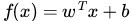
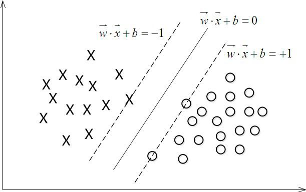
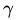
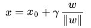
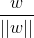
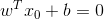
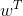
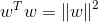
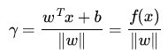
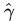

# 支持向量机（SVM:Support Vector Machine）
支持向量机是一种十分常见的分类器(二分类)，分类能力强于NN，整体实力比肩LR（逻辑回归）与RF（随机森林）。核心思路是通过构造分割面将数据进行分离  

基本模型定义为特征空间上的间隔最大的线性分类器，其学习策略便是间隔最大化，最终可转化为一个凸二次规划问题的求解  

模型包含以下三种情况：  
1. 当训练样本线性可分时，通过硬间隔最大化，学习一个线性可分支持向量机；  
2. 当训练样本近似线性可分时，通过软间隔最大化，学习一个线性支持向量机；  
3. 当训练样本线性不可分时，通过核技巧和软间隔最大化，学习一个非线性支持向量机；  

SVM的目标是寻找一个超平面，使得离超平面较近的异类点之间能有更大的间隔，即不必考虑所有样本点，只需让求得的超平面使得离它近的点间隔最大

## 间隔（margin）和支持向量  
对于二分类问题，超平面可以使用分类函数表示，当f(x) 等于0的时候，x便是位于超平面上的点，而f(x)大于0的点对应 y=1 的数据点，f(x)小于0的点对应y=-1的点，如下图所示  
  

**函数间隔：**
在超平面w\*x+b=0确定的情况下，|w\*x+b|能够表示点x到距离超平面的远近，而通过观察w\*x+b的符号与类标记y的符号是否一致可判断分类是否正确，所以，可以用(y\*(w\*x+b))的正负性来判定或表示分类的正确性。于是，我们便引出了函数间隔（functional margin）的概念。  

定义函数间隔（用表示）为：  
  
而超平面(w，b)关于T中所有样本点(xi，yi)的函数间隔最小值（其中，x是特征，y是结果标签，i表示第i个样本），便为超平面(w, b)关于训练数据集T的函数间隔  

但这样定义的函数间隔有问题，即如果成比例的改变w和b（如将它们改成2w和2b），则函数间隔的值f(x)却变成了原来的2倍（虽然此时超平面没有改变），所以只有函数间隔还远远不够  

**几何间隔：**
假定对于一个点 x ，令其垂直投影到超平面上的对应点为 x0 ，w 是垂直于超平面的一个向量，为样本x到超平面的距离，如下图所示：  
  
根据几何知识有：  
  
其中||w||为w的二阶范数（范数是一个类似于模的表示长度的概念），是单位向量（一个向量除以它的模谓之单位向量）。  
由于x0是超平面上的点,代入方程有;  
代入,等式两边同乘,根据,可以算出  
  
为了得到的绝对值，令乘上对应的类别 y，即可得出几何间隔（用表示）的定义  
  
从上述函数间隔和几何间隔的定义可以看出：几何间隔就是函数间隔除以||w||，而且函数间隔y*(wx+b) = y*f(x)实际上就是|f(x)|，只是人为定义的一个间隔度量，而几何间隔|f(x)|/||w||才是直观上的点到超平面的距离

## 间隔最大化与支持向量
在样本空间中，划分超平面可以通过如下线性方程来描述： 
  
其中w=(w1;w2;...;wd)为法向量，决定了超平面的方向，b为位移量，决定了超平面与原点的距离。  
假设超平面能将训练样本正确地分类，即对于训练样本(xi,yi)，满足以下公式：  
  
公式（2）称为**最大间隔假设**，yi=+1 表示样本为正样本，yi=−1 表示样本为负样本，式子前面选择大于等于+1，小于等于-1只是为了计算方便，原则上可以是任意常数，但无论是多少，都可以通过对 w 的变换使其为 +1 和 -1 。  
将公式（2）左右都乘以 yi，得：  
  
等价于：  
  
训练集中的所有样本都应满足公式（3）。如下图所示，距离超平面最近的这几个样本点满足 yi(wTxi+b)=1，它们被称为“**支持向量**”。虚线称为边界，两条虚线间的距离称为**间隔（margin）**。   
  

### 间隔计算
间隔就等于两个异类支持向量的差在 w 上的投影，即：
  
其中 x+ 和 x− 分别表示两个正负支持向量，因为 x+ 和 x− 满足 ，即：  
  
推导出：  
  
代入公式（4）中可以得到间隔为：  
  


SVM的思想是使得间隔最大化，也就是：  
  
为了计算方便，将公式（6）转化成如下：   
  
公式（7）即为支持向量机的**基本型**。  

## 对偶问题
对偶问题：每一个线性规划问题都伴随有另一个线性规划问题，称为对偶问题；原来的线性规划问题则称为原始线性规划问题，简称原始问题。  
公式（7）本身是一个凸二次规划问题，可以使用现有的优化计算包来计算，但我们选择更为高效的方法。对公式（7）使用拉格朗日乘子法得到其对偶问题，该问题的拉格朗日函数可以写为：   
  
公式（8）分别对 w 和 b求偏导：  
  
令其分别为0，可以得到：  
  
将公式（9）（10）代入公式（8），可得：   
  
此时，原问题就转化为以下仅关于 α 的问题：   
  

解出 α 之后，根据公式（9）可以求得 w ， 进而求得 b，可以得到模型：   
  
上述过程的KKT条件（必要和充分条件）为：   
  

我们分析一下，对于任意的训练样本 (xi,yi)：  
若 αi=0，则其不会在公式（13）中的求和项中出现，也就是说，它不影响模型的训练；  
若 αi>0，则 yif(xi)−1=0，也就是 yif(xi)=1，即该样本一定在边界上，是一个支持向量。  
这里显示出了支持向量机的重要特征：**当训练完成后，大部分样本都不需要保留，最终模型只与支持向量有关**  


## 非线性支持向量机和核函数
对于非线性问题，线性可分支持向量机并不能有效解决，要使用非线性模型才能很好地分类。先看一个例子，如下图，很显然使用直线并不能将两类样本分开，但是可以使用一条椭圆曲线（非线性模型）将它们分开。非线性问题往往不好求解，所以希望能用解线性分类问题的方法求解，因此可以采用非线性变换，将非线性问题变换成线性问题。  
   
对于这样的问题，可以将训练样本从原始空间映射到一个更高维的空间，使得样本在这个空间中线性可分，如果原始空间维数是有限的，即属性是有限的，那么一定存在一个高维特征空间是样本可分。令ϕ(x)表示将 x 映射后的特征向量，于是在特征空间中，划分超平面所对应的的模型可表示为：  
  
于是有最小化函数：  
  
其对偶问题为：  
  

若要对公式（16）求解，会涉及到计算 ，这是样本 xi 和 xj映射到特征空间之后的内积，由于特征空间的维数可能很高，甚至是无穷维，因此直接计算 通常是困难的，于是想到这样一个函数：  
  
即 xi 和 xj 在特征空间中的内积等于他们在原始样本空间中通过函数 κ(xi,xj) 计算的函数值，于是公式（16）写成如下：  
  
求解后得到：   
  
**函数 κ(xi,xj) 就是核函数**

## 常用核函数
### 线性核
  

### 多项式核（d是多项式的次数，d=1是退化为线性核）
  

### 高斯核（σ>0）/RBF(Radial Basis Function)核
  

### 拉普拉斯核（σ>0）
  

### sigmiod核（β>0,θ>0）
  

**核函数也可以通过组合得到**

## 线性支持向量机（软间隔支持向量机）与松弛变量
在前面的讨论中，我们假设训练样本在样本空间或者特征空间中是线性可分的，但在现实任务中往往很难确定合适的核函数使训练集在特征空间中线性可分，退一步说，即使恰好找到了这样的核函数使得样本在特征空间中线性可分，也很难判断是不是由于过拟合造成。  
线性不可分意味着某些样本点 (xi,yi) 不能满足式（3）间隔大于等于1的条件，样本点落在超平面与边界之间。为解决这一问题，可以对每个样本点引入一个松弛变量 ξi≥0，使得间隔加上松弛变量大于等于1，这样约束条件变为：  
  
同时，对于每一个松弛变量 ξi≥0，支付一个代价 ξi≥0，目标函数变为：   
  
其中 C>0为惩罚参数，C值大时对误分类的惩罚增大， C值小时对误分类的惩罚减小，公式（21）包含两层含义：使 ||w||^2 尽量小即间隔尽量大，同时使误分类点的个数尽量小，C是调和两者的系数。   
线性支持向量机的学习问题变成如下凸二次规划问题的求解（原始问题）：  
  
与线性可分支持向量机的对偶问题解法一致，公式（22）的拉格朗日函数为：   
  
其中 αi≥0,μi≥0 是拉格朗日乘子。  
令 L(w,b,α,ξ,μ) 对 w,b,ξ的偏导数为0可得如下：   
  
将公式（24）（25）（26）代入公式（23）得对偶问题：
  
解出 α 之后，根据公式（9）可以求得 w ， 进而求得 b，可以得到模型：   
  
上述过程的KKT条件为：   
  

我们分析一下，对于任意的训练样本 (xi,yi) ，总有 αi=0 或者 yif(xi)−1+ξi=0 。  
若 αi=0 ，则该样本不出现在公式（13）中，不影响模型。  
若 αi>0，必有 yif(xi)−1+ξi=0 ，即 yif(xi)=1−ξi ，此时该样本为支持向量。  
由于 C=αi+μi （公式26）  
若 αi<C， 则必有 μi>0 ，根据公式（28）知 ξi=0 ，即该样本恰好落在最大间隔的边界上；  
若 αi=C ，则 μi=0，此时若 ξi≤1 则该样本在最大间隔内部，若 ξi>1 则样本分类错误  


## C参数
调整分类误差，使用C参数乘以所有的分类误差  
C参数较小，则间隔较大，分类误差较多  
C参数较大，分类更加准确，间隔较小  


## sklearn中使用支持向量机
```
# Import statements 
from sklearn.svm import SVC
from sklearn.metrics import accuracy_score
import pandas as pd
import numpy as np

# Read the data.
data = np.asarray(pd.read_csv('data.csv', header=None))
# Assign the features to the variable X, and the labels to the variable y. 
X = data[:,0:2]
y = data[:,2]

# TODO: Create the model and assign it to the variable model.
# Find the right parameters for this model to achieve 100% accuracy on the dataset.
# 多项式核函数（ploynomial kernel）
#model = SVC(kernel='poly', degree=4, C=0.1)  
# 径向机核函数(radical basis function)
model = SVC(kernel='rbf', gamma=27)

# TODO: Fit the model.
model.fit(X,y)

# TODO: Make predictions. Store them in the variable y_pred.
y_pred = model.predict(X)

# TODO: Calculate the accuracy and assign it to the variable acc.
acc = accuracy_score(y, y_pred)
```


