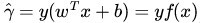
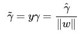

# 支持向量机（SVM:Support Vector Machine）
支持向量机是一种十分常见的分类器(二类分类)，分类能力强于NN，整体实力比肩LR（逻辑回归）与RF（随机森林）。核心思路是通过构造分割面将数据进行分离  

基本模型定义为特征空间上的间隔最大的线性分类器，其学习策略便是间隔最大化，最终可转化为一个凸二次规划问题的求解  

## 间隔（margin）和支持向量  
对于二分类问题，超平面可以使用分类函数表示，当f(x) 等于0的时候，x便是位于超平面上的点，而f(x)大于0的点对应 y=1 的数据点，f(x)小于0的点对应y=-1的点，如下图所示  
  

**函数间隔：**
在超平面w\*x+b=0确定的情况下，|w\*x+b|能够表示点x到距离超平面的远近，而通过观察w\*x+b的符号与类标记y的符号是否一致可判断分类是否正确，所以，可以用(y\*(w\*x+b))的正负性来判定或表示分类的正确性。于是，我们便引出了函数间隔（functional margin）的概念。  

定义函数间隔（用表示）为：  
  
而超平面(w，b)关于T中所有样本点(xi，yi)的函数间隔最小值（其中，x是特征，y是结果标签，i表示第i个样本），便为超平面(w, b)关于训练数据集T的函数间隔  

但这样定义的函数间隔有问题，即如果成比例的改变w和b（如将它们改成2w和2b），则函数间隔的值f(x)却变成了原来的2倍（虽然此时超平面没有改变），所以只有函数间隔还远远不够  

**几何间隔：**
假定对于一个点 x ，令其垂直投影到超平面上的对应点为 x0 ，w 是垂直于超平面的一个向量，为样本x到超平面的距离，如下图所示：  
  
根据几何知识有：  
  
其中||w||为w的二阶范数（范数是一个类似于模的表示长度的概念），是单位向量（一个向量除以它的模谓之单位向量）。  
由于x0是超平面上的点,代入方程有;  
代入,等式两边同乘,根据,可以算出  
  
为了得到的绝对值，令乘上对应的类别 y，即可得出几何间隔（用表示）的定义  
  
从上述函数间隔和几何间隔的定义可以看出：几何间隔就是函数间隔除以||w||，而且函数间隔y*(wx+b) = y*f(x)实际上就是|f(x)|，只是人为定义的一个间隔度量，而几何间隔|f(x)|/||w||才是直观上的点到超平面的距离


## 感知器算法
计算模型误差，然后通过梯度下降法来最小化误差，找到理想的线性划分  

## 分类误差
所有点分类错误误差之和  

## 边际误差

## C参数
调整分类误差，使用C参数乘以所有的分类误差  
C参数较小，则间隔较大，分类误差较多  
C参数较大，分类更加准确，间隔较小  

## 多项式核
多项式核是一个超参数，将数据映射到更高纬度空间进行划分  

## RBF核


## sklearn中使用支持向量机
```
# Import statements 
from sklearn.svm import SVC
from sklearn.metrics import accuracy_score
import pandas as pd
import numpy as np

# Read the data.
data = np.asarray(pd.read_csv('data.csv', header=None))
# Assign the features to the variable X, and the labels to the variable y. 
X = data[:,0:2]
y = data[:,2]

# TODO: Create the model and assign it to the variable model.
# Find the right parameters for this model to achieve 100% accuracy on the dataset.
# 多项式核函数（ploynomial kernel）
#model = SVC(kernel='poly', degree=4, C=0.1)  
# 径向机核函数(radical basis function)
model = SVC(kernel='rbf', gamma=27)

# TODO: Fit the model.
model.fit(X,y)

# TODO: Make predictions. Store them in the variable y_pred.
y_pred = model.predict(X)

# TODO: Calculate the accuracy and assign it to the variable acc.
acc = accuracy_score(y, y_pred)
```


