# 线性回归
## 绝对值技巧
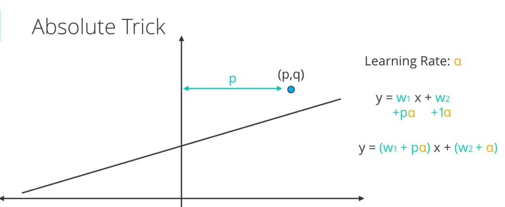
## 平方技巧
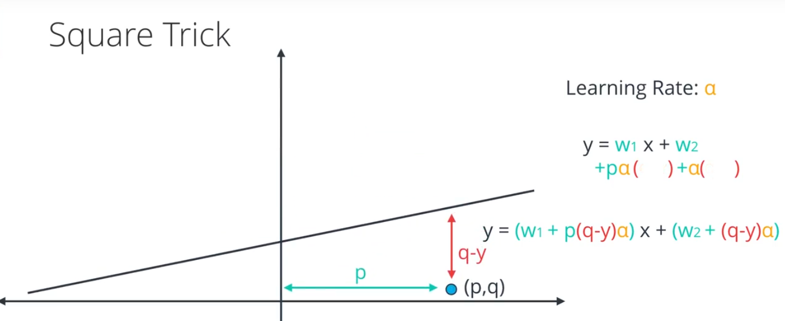
## 平均绝对值误差
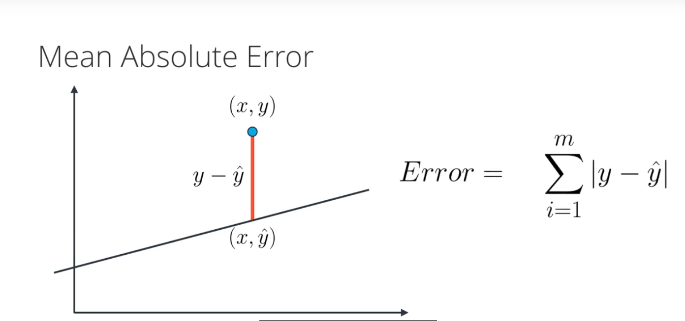
## 平均平方误差
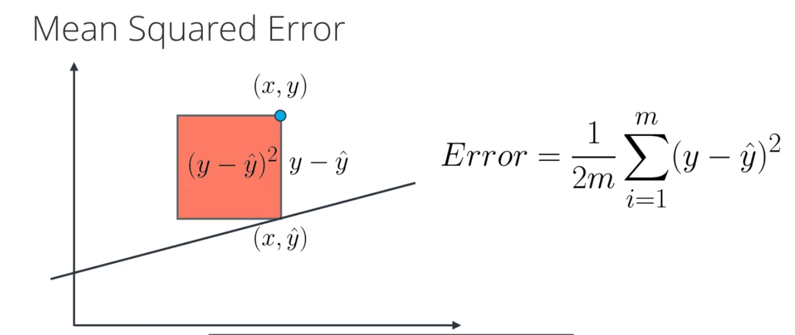  

## 最小二乘法（Least Square）
以最简单的一元线性模型来解释最小二乘法；最小二乘法以平方和作为损失，损失函数为：  

通过最小化损失Q，求直线y=B0+B1x，即确定B0和B1的值，把它们看作是Q的函数，就变成了一个求极值的问题，可以通过求导数得到。求Q对两个待估参数的偏导数：  

根据数学知识我们知道，函数的极值点为偏导为0的点。解得：  

参考:https://www.cnblogs.com/armysheng/p/3422923.html

## 梯度下降算法
> 梯度下降算法（Gradient Descent Optimization）是神经网络模型训练最常用的优化算法。对于深度学习模型，基本都是采用梯度下降算法来进行优化训练的。梯度下降算法背后的原理：目标函数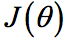关于参数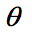的梯度将是目标函数上升最快的方向。对于最小化优化问题，只需要将参数沿着梯度相反的方向前进一个步长，就可以实现目标函数的下降。这个步长又称为学习速率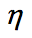。参数更新公式如下：  
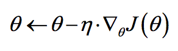  
其中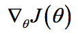是参数的梯度，根据计算目标函数采用数据量的不同，梯度下降算法又可以分为批量梯度下降算法（Batch Gradient Descent），随机梯度下降算法（Stochastic GradientDescent）和小批量梯度下降算法（Mini-batch Gradient Descent）。对于批量梯度下降算法，其是在整个训练集上计算的，如果数据集比较大，可能会面临内存不足问题，而且其收敛速度一般比较慢。随机梯度下降算法是另外一个极端，是针对训练集中的一个训练样本计算的，又称为在线学习，即得到了一个样本，就可以执行一次参数更新。所以其收敛速度会快一些，但是有可能出现目标函数值震荡现象，因为高频率的参数更新导致了高方差。小批量梯度下降算法是折中方案，选取训练集中一个小批量样本计算，这样可以保证训练过程更稳定，而且采用批量训练方法也可以利用矩阵计算的优势。这是目前最常用的梯度下降算法。  

> 对于神经网络模型，借助于BP算法可以高效地计算梯度，从而实施梯度下降算法。但梯度下降算法一个老大难的问题是：不能保证全局收敛。如果这个问题解决了，深度学习的世界会和谐很多。梯度下降算法针对凸优化问题原则上是可以收敛到全局最优的，因为此时只有唯一的局部最优点。而实际上深度学习模型是一个复杂的非线性结构，一般属于非凸问题，这意味着存在很多局部最优点（鞍点），采用梯度下降算法可能会陷入局部最优，这应该是最头疼的问题。这点和进化算法如遗传算法很类似，都无法保证收敛到全局最优。因此，我们注定在这个问题上成为“高级调参师”。可以看到，梯度下降算法中一个重要的参数是学习速率，适当的学习速率很重要：学习速率过小时收敛速度慢，而过大时导致训练震荡，而且可能会发散。理想的梯度下降算法要满足两点：收敛速度要快；能全局收敛。为了这个理想，出现了很多经典梯度下降算法的变种  

## 最小二乘法与梯度下降法比较
最小二乘法跟梯度下降法都是通过求导来求损失函数的最小值  
### 相同点
1. 本质相同：两种方法都是在给定已知数据（independent & dependent variables）的前提下对dependent variables算出出一个一般性的估值函数。然后对给定新数据的dependent variables进行估算。  
2. 目标相同：都是在已知数据的框架内，使得估算值与实际值的总平方差尽量更小  

### 不同点
实现方法和结果不同：最小二乘法是直接对损失函数求导找出全局最小，是非迭代法；梯度下降法是一种迭代法，先给定一个步长（学习率） ，然后向梯度下降最快的方向调整一个步长 ，在若干次迭代之后找到局部最小。  

## 在scikit-learn中使用线性回归
> 源码：solution.py
1. 加载数据
2. 构建线性回归模型 LinearRegression
3. 使用模型进行预测

## 线性回归注意事项
### 适用于线性数据
> 线性回归会根据训练数据生成直线模型。如果训练数据包含非线性关系，你需要选择：调整数据（进行数据转换）、增加特征数量或改用其他模型

### 容易受到异常值影响
> 线性回归的目标是求取对训练数据而言的 “最优拟合” 直线。如果数据集中存在不符合总体规律的异常值，最终结果将会存在不小偏差

## [正则化](https://baike.baidu.com/item/%E6%AD%A3%E5%88%99%E5%8C%96%E6%96%B9%E6%B3%95/19145625?fr=aladdin)
> 正则化方法是在训练数据不够多时，或者over training时，常常会导致过拟合（overfitting）。这时向原始模型引入额外信息，以便防止过拟合和提高模型泛化性能的一类方法的统称。在实际的深度学习场景中我们几乎总是会发现，最好的拟合模型（从最小化泛化误差的意义上）是一个适当正则化的大型模型。

>主要使用一下三种方式实现正则化：  
>1.参数范式惩罚，L1,L2范数  
>2.数据集合扩充  
>3.dropout  

### 参数添加约束，L1,L2正则化
>通过向目标函数添加一个参数范数惩罚来降低模型的容量
>参数范式惩罚：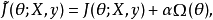

#### L1正则化
> L1正则化为各个参数的绝对值之和
> 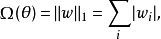

#### L2正则化
> L2正则化为各个参数的平方和
> 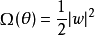

#### L1和L2正则化比较
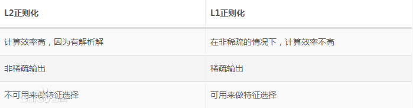

### 数据集合扩展
> 防止过拟合最有效的方法是增加训练集合，训练集合越大过拟合概率越小。数据集合扩充是一个省时有效的方法，但是在不同领域方法不太通用。   
1. 在目标识别领域常用的方法是将图片进行旋转、缩放等（图片变换的前提是通过变换不能改变图片所属类别，例如手写数字识别，类别6和9进行旋转后容易改变类目）   
2. 语音识别中对输入数据添加随机噪声   
3. NLP中常用思路是进行近义词替换   
4. 噪声注入，可以对输入添加噪声，也可以对隐藏层或者输出层添加噪声。例如对于softmax 分类问题可以通过 Label Smoothing技术添加噪声，对于类目0-1添加噪声，则对应概率变成  

## Logistic回归（对数几率回归）
 Logistic回归目的是从特征学习出一个0/1分类模型，而这个模型是将特性的线性组合（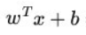）作为自变量，由于自变量的取值范围是负无穷到正无穷。因此，使用logistic函数（或称作sigmoid函数）将自变量映射到(0,1)上，映射后的值被认为是属于y=1的概率  

单位阶跃函数：  
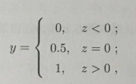  

对数几率函数：  
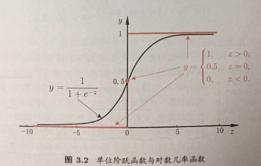  

## 逻辑回归优点和缺点  
**优点：**  
1. 实现简单，广泛的应用于工业问题上；  
2. 分类时计算量非常小，速度很快，存储资源低；  
3. 便利的观测样本概率分布；  
4. 对逻辑回归而言，多重共线性并不是问题，它可以结合L2正则化来解决该问题；  

**缺点：**  
1. 当特征空间很大时，逻辑回归的性能不是很好；  
2. 容易欠拟合，一般准确度不太高  
3. 不能很好地处理大量多类特征或变量；  
4. 只能处理两分类问题（在此基础上衍生出来的softmax可以用于多分类），且必须线性可分；  
5. 对于非线性特征，需要进行转换；  

