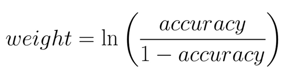

# 集成方法（Ensemble Method）
将弱学习器整合在一起组成强学习器

## Bagging（自助聚类 bootstrap aggregating）
弱学习器通过投票的方式，决定样本分类结果

## Boosting
### AdaBoost
首先以最高准确率拟合一个学习器，再拟合第二个学习器修正第一个学习器错误，以此类推
计算出各个弱学习器的模型权重，根据权重进行投票，决定样本的分类结果

** 数据权重 **
将分类错误的数据权重调整为：  （分类正确样本权重之和）/（分类错误样本权重之和）
** 模型权重 **


## sklearn中使用AdaBoost
```
from sklearn.ensemble import AdaBoostClassifier
from sklearn.tree import DecisionTreeClassifier
# base_estimator: 弱学习器使用的模型
# n_estimators: 使用的弱学习器的最大数量
 model = AdaBoostClassifier(base_estimator = DecisionTreeClassifier(max_depth=2), n_estimators = 4)
model.fit(x_train, y_train)
model.predict(x_test)
```
